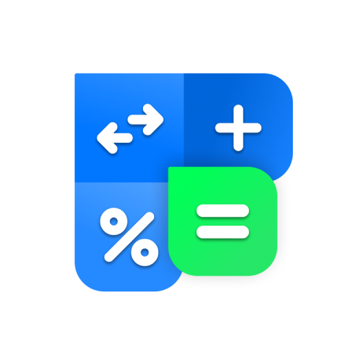
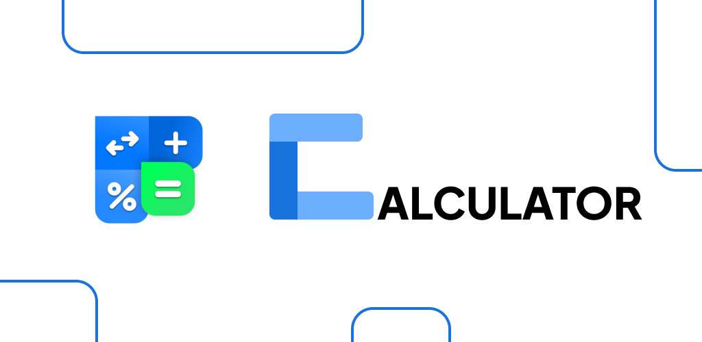
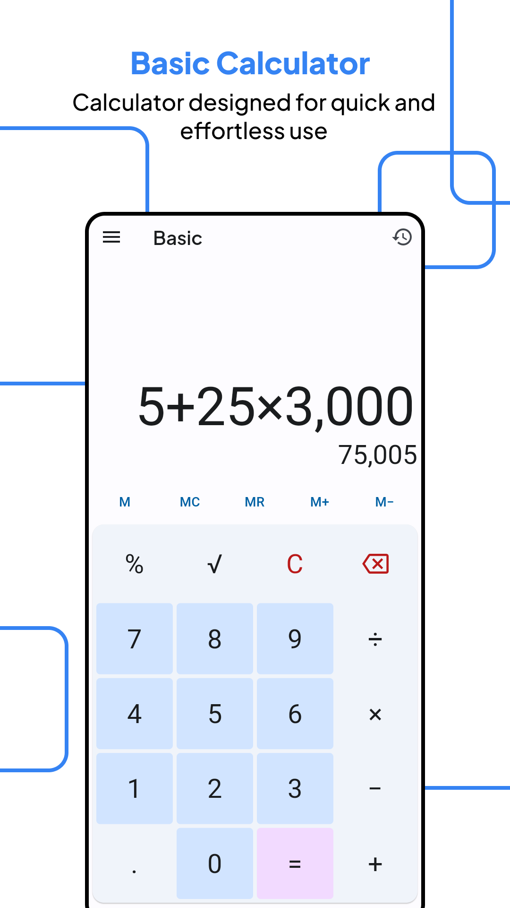
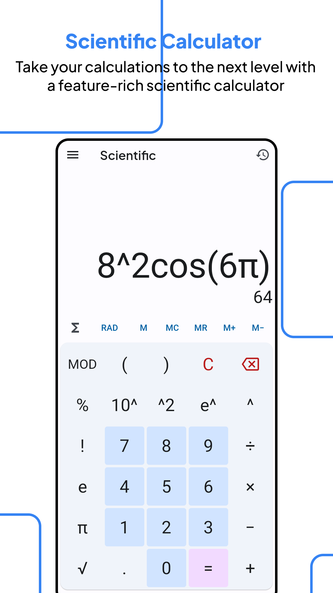
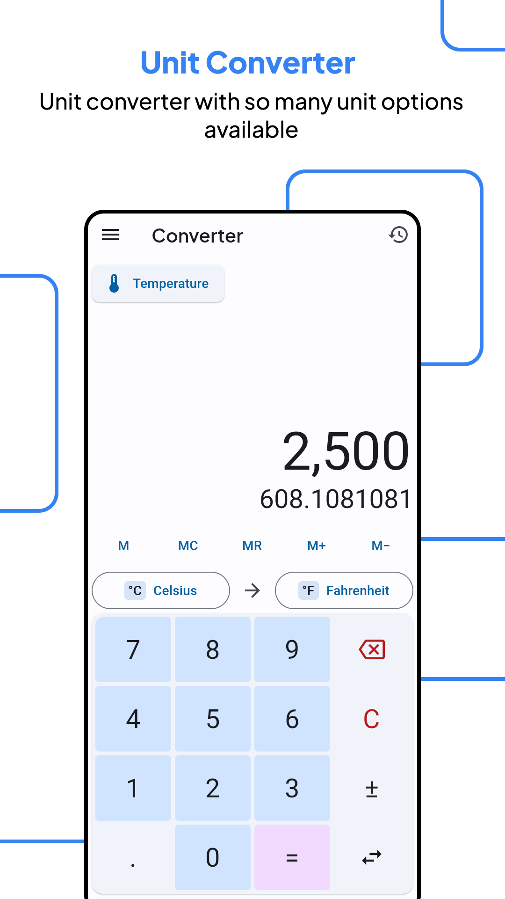
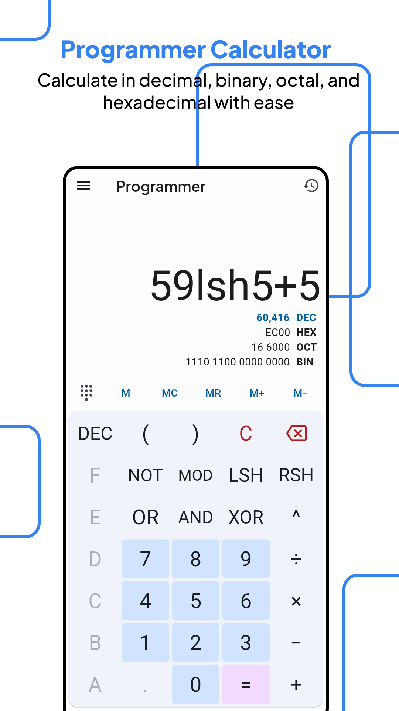
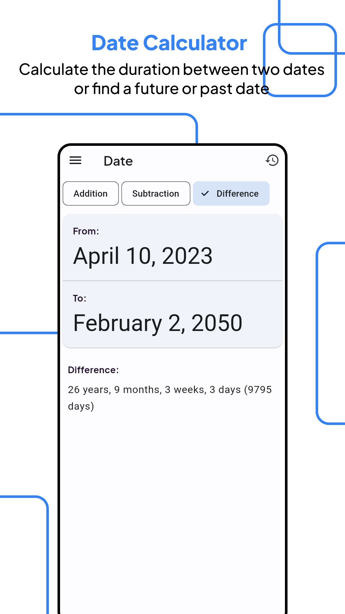
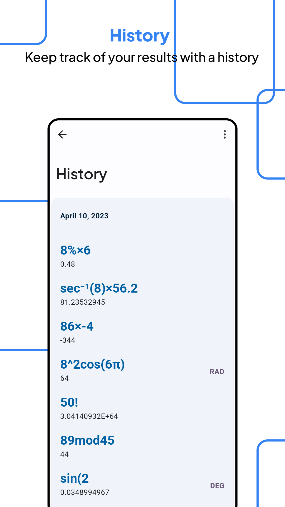
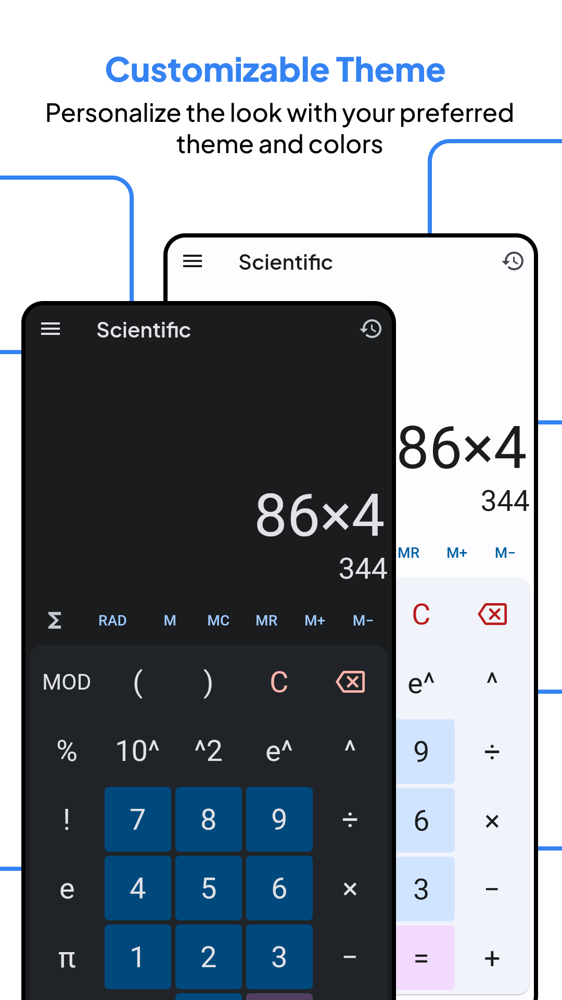

# Calculator

## Header

## Screenshot

## What's new

- Optimized layout for landscape mode

## Description

> Play store link: [Calculator](https://play.google.com/store/apps/details?id=com.redmerah.calculator)

One app, 5 calculators.

Looking for a reliable and comprehensive calculator app? Look no further than our all-in-one calculator! With 5 calculators in one app, you can tackle any calculation that comes your way. Here's what you can expect from each calculator:

- Basic calculator: For quick and simple calculations, our basic calculator has everything you need. It features a simple user interface with numbers 0-9 and basic operators (+, -, *, /) for all your day-to-day calculations.
- Scientific calculator: If you need to dive into more complex calculations, our scientific calculator is perfect for you. It includes functions, trigonometry, pi, euler, exponential, and other scientific calculations you may need.
- Unit converter: Need to convert units quickly? Our unit converter has you covered. With options for length, area, volume, temperature, pressure, weight & mass, time, and more, you can convert any unit with ease.
- Programmer calculator: For developers, our programmer calculator includes decimal, hex, octal, and binary options, along with logic gate operators and binary manipulation. With this calculator, you can handle any programming-related calculation with ease.
- Date calculator: Finally, our date calculator makes it easy to calculate the difference between two dates or find out what a future/past date will be. With options for years, months, and days, this calculator is perfect for planning ahead.

But that's not all our calculator app has to offer! We've also included some great features to make your experience even better:

- History: Keep track of your past calculations with our history feature. This makes it easy to review your work or pick up where you left off.
- Themes: Customize your calculator with our light or dark themes, or pick your own color scheme.
- Memory buttons: Save numbers for future use with our memory buttons (MR, MC, M+, M-, M).
- Stay awake: Keep your screen awake while you calculate with our "stay awake" option.
- Scientific notation: Simplify large or small numbers with our scientific notation feature. Optional, but incredibly useful.

With so many features and calculators in one app, our calculator is sure to become your go-to for all your calculations. Download it today and start crunching those numbers!